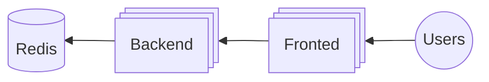

# Counter Example

```mermaid
flowchart RL
  USER@{ shape: circle, label: "Users" } --> FRONTEND
  FRONTEND@{ shape: procs, label: "Fronted" } --> BACKEND
  BACKEND@{ shape: procs, label: "Backend" } --> DB
  DB@{ shape: cyl, label: "Redis" }
```
