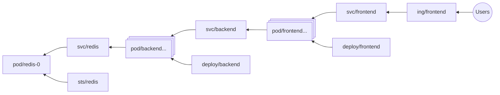

# Counter Example

```mermaid
flowchart RL
  USER@{ shape: circle, label: "Users" } --> FRONTEND
  FRONTEND@{ shape: procs, label: "Fronted" } --> BACKEND
  BACKEND@{ shape: procs, label: "Backend" } --> DB
  DB@{ shape: cyl, label: "Redis" }
```

```mermaid
flowchart RL
  USER@{ shape: circle, label: "Users" } --> INGRESS_FE
  INGRESS_FE@{ shape: rectangle, label: "ing/frontend" } --> SERVICE_FE
  SERVICE_FE@{ shape: rectangle, label: "svc/frontend" } --> PODS_FE
  PODS_FE@{ shape: procs, label: "pod/frontend..." }
  DEPLOY_FE@{ shape: rectangle, label: "deploy/frontend" } --> PODS_FE
  PODS_FE --> SERVICE_BE

  SERVICE_BE@{ shape: rectangle, label: "svc/backend" } --> PODS_BE
  PODS_BE@{ shape: procs, label: "pod/backend..." }
  DEPLOY_BE@{ shape: rectangle, label: "deploy/backend" } --> PODS_BE
  PODS_BE --> SERVICE_REDIS

  SERVICE_REDIS@{ shape: rectangle, label: "svc/redis" } --> POD_REDIS
  POD_REDIS@{ shape: proc, label: "pod/redis-0" }
  DEPLOY_REDIS@{ shape: rectangle, label: "sts/redis" } --> POD_REDIS
```
