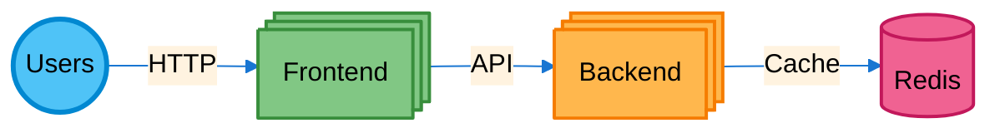

# Counter Example

## High-Level Architecture

```mermaid
%%{init: {'theme':'base', 'themeVariables': { 'primaryColor':'#e3f2fd','primaryTextColor':'#000','primaryBorderColor':'#2196f3','lineColor':'#1976d2','secondaryColor':'#fff3e0','tertiaryColor':'#f3e5f5'}}}%%
flowchart LR
  USER@{ shape: circle, label: "Users" }
  FRONTEND@{ shape: procs, label: "Frontend" }
  BACKEND@{ shape: procs, label: "Backend" }
  DB@{ shape: cyl, label: "Redis" }

  USER -->|HTTP| FRONTEND
  FRONTEND -->|API| BACKEND
  BACKEND -->|Cache| DB

  style USER fill:#4fc3f7,stroke:#0288d1,stroke-width:3px,color:#000
  style FRONTEND fill:#81c784,stroke:#388e3c,stroke-width:2px,color:#000
  style BACKEND fill:#ffb74d,stroke:#f57c00,stroke-width:2px,color:#000
  style DB fill:#f06292,stroke:#c2185b,stroke-width:2px,color:#000
```

## Kubernetes Components - Single Frontend

```mermaid
%%{init: {'theme':'base', 'themeVariables': { 'primaryColor':'#e8f5e9','primaryTextColor':'#000','primaryBorderColor':'#4caf50','lineColor':'#1976d2','secondaryColor':'#fff3e0','tertiaryColor':'#f3e5f5'}}}%%
flowchart LR
  USER@{ shape: circle, label: "Users" }

  subgraph frontend["Frontend Layer"]
    direction LR
    INGRESS_FE@{ shape: rectangle, label: "ing/frontend" }
    SERVICE_FE@{ shape: rectangle, label: "svc/frontend" }
    PODS_FE@{ shape: procs, label: "pod/frontend..." }
    DEPLOY_FE@{ shape: rectangle, label: "deploy/frontend" }
  end

  subgraph backend["Backend Layer"]
    direction LR
    SERVICE_BE@{ shape: rectangle, label: "svc/backend" }
    PODS_BE@{ shape: procs, label: "pod/backend..." }
    DEPLOY_BE@{ shape: rectangle, label: "deploy/backend" }
  end

  subgraph database["Database Layer"]
    direction LR
    SERVICE_REDIS@{ shape: rectangle, label: "svc/redis" }
    POD_REDIS@{ shape: proc, label: "pod/redis-0" }
    DEPLOY_REDIS@{ shape: rectangle, label: "sts/redis" }
  end

  USER -->|HTTP| INGRESS_FE
  INGRESS_FE --> SERVICE_FE
  SERVICE_FE --> PODS_FE
  DEPLOY_FE -.->|manages| PODS_FE
  PODS_FE -->|API| SERVICE_BE
  SERVICE_BE --> PODS_BE
  DEPLOY_BE -.->|manages| PODS_BE
  PODS_BE -->|Cache| SERVICE_REDIS
  SERVICE_REDIS --> POD_REDIS
  DEPLOY_REDIS -.->|manages| POD_REDIS

  style USER fill:#4fc3f7,stroke:#0288d1,stroke-width:3px,color:#000
  style frontend fill:#e8f5e9,stroke:#4caf50,stroke-width:2px
  style backend fill:#fff3e0,stroke:#ff9800,stroke-width:2px
  style database fill:#fce4ec,stroke:#e91e63,stroke-width:2px
  style INGRESS_FE fill:#81c784,stroke:#388e3c,stroke-width:2px,color:#000
  style SERVICE_FE fill:#a5d6a7,stroke:#388e3c,stroke-width:2px,color:#000
  style PODS_FE fill:#c8e6c9,stroke:#388e3c,stroke-width:2px,color:#000
  style DEPLOY_FE fill:#66bb6a,stroke:#2e7d32,stroke-width:2px,color:#000
  style SERVICE_BE fill:#ffcc80,stroke:#f57c00,stroke-width:2px,color:#000
  style PODS_BE fill:#ffe0b2,stroke:#f57c00,stroke-width:2px,color:#000
  style DEPLOY_BE fill:#ffb74d,stroke:#e65100,stroke-width:2px,color:#000
  style SERVICE_REDIS fill:#f48fb1,stroke:#c2185b,stroke-width:2px,color:#000
  style POD_REDIS fill:#f8bbd0,stroke:#c2185b,stroke-width:2px,color:#000
  style DEPLOY_REDIS fill:#f06292,stroke:#880e4f,stroke-width:2px,color:#000
```

## Kubernetes Components - Multiple Frontends

```mermaid
%%{init: {'theme':'base', 'themeVariables': { 'primaryColor':'#e8f5e9','primaryTextColor':'#000','primaryBorderColor':'#4caf50','lineColor':'#1976d2','secondaryColor':'#fff3e0','tertiaryColor':'#f3e5f5'}}}%%
flowchart LR
  USER@{ shape: circle, label: "Users" }
  USER2@{ shape: circle, label: "Users" }

  subgraph frontend_js["Frontend Layer - JavaScript"]
    direction LR
    INGRESS_FE@{ shape: rectangle, label: "ing/frontend" }
    SERVICE_FE@{ shape: rectangle, label: "svc/frontend" }
    PODS_FE@{ shape: procs, label: "pod/frontend..." }
    DEPLOY_FE@{ shape: rectangle, label: "deploy/frontend" }
  end

  subgraph frontend_go["Frontend Layer - Go"]
    direction LR
    INGRESS_FE_GO@{ shape: rectangle, label: "ing/frontend-go" }
    SERVICE_FE_GO@{ shape: rectangle, label: "svc/frontend-go" }
    PODS_FE_GO@{ shape: procs, label: "pod/frontend-go..." }
    DEPLOY_FE_GO@{ shape: rectangle, label: "deploy/frontend-go" }
  end

  subgraph backend["Backend Layer"]
    direction LR
    SERVICE_BE@{ shape: rectangle, label: "svc/backend" }
    PODS_BE@{ shape: procs, label: "pod/backend..." }
    DEPLOY_BE@{ shape: rectangle, label: "deploy/backend" }
  end

  subgraph database["Database Layer"]
    direction LR
    SERVICE_REDIS@{ shape: rectangle, label: "svc/redis" }
    POD_REDIS@{ shape: proc, label: "pod/redis-0" }
    DEPLOY_REDIS@{ shape: rectangle, label: "sts/redis" }
  end

  USER2 -->|HTTP| INGRESS_FE
  INGRESS_FE --> SERVICE_FE
  SERVICE_FE --> PODS_FE
  DEPLOY_FE -.->|manages| PODS_FE

  USER -->|HTTP| INGRESS_FE_GO
  INGRESS_FE_GO --> SERVICE_FE_GO
  SERVICE_FE_GO --> PODS_FE_GO
  DEPLOY_FE_GO -.->|manages| PODS_FE_GO

  PODS_FE -->|API| SERVICE_BE
  PODS_FE_GO -->|API| SERVICE_BE
  SERVICE_BE --> PODS_BE
  DEPLOY_BE -.->|manages| PODS_BE
  PODS_BE -->|Cache| SERVICE_REDIS
  SERVICE_REDIS --> POD_REDIS
  DEPLOY_REDIS -.->|manages| POD_REDIS

  style USER fill:#4fc3f7,stroke:#0288d1,stroke-width:3px,color:#000
  style USER2 fill:#4fc3f7,stroke:#0288d1,stroke-width:3px,color:#000
  style frontend_js fill:#e8f5e9,stroke:#4caf50,stroke-width:2px
  style frontend_go fill:#e1f5fe,stroke:#0288d1,stroke-width:2px
  style backend fill:#fff3e0,stroke:#ff9800,stroke-width:2px
  style database fill:#fce4ec,stroke:#e91e63,stroke-width:2px

  style INGRESS_FE fill:#81c784,stroke:#388e3c,stroke-width:2px,color:#000
  style SERVICE_FE fill:#a5d6a7,stroke:#388e3c,stroke-width:2px,color:#000
  style PODS_FE fill:#c8e6c9,stroke:#388e3c,stroke-width:2px,color:#000
  style DEPLOY_FE fill:#66bb6a,stroke:#2e7d32,stroke-width:2px,color:#000

  style INGRESS_FE_GO fill:#4fc3f7,stroke:#0277bd,stroke-width:2px,color:#000
  style SERVICE_FE_GO fill:#81d4fa,stroke:#0277bd,stroke-width:2px,color:#000
  style PODS_FE_GO fill:#b3e5fc,stroke:#0277bd,stroke-width:2px,color:#000
  style DEPLOY_FE_GO fill:#29b6f6,stroke:#01579b,stroke-width:2px,color:#000

  style SERVICE_BE fill:#ffcc80,stroke:#f57c00,stroke-width:2px,color:#000
  style PODS_BE fill:#ffe0b2,stroke:#f57c00,stroke-width:2px,color:#000
  style DEPLOY_BE fill:#ffb74d,stroke:#e65100,stroke-width:2px,color:#000

  style SERVICE_REDIS fill:#f48fb1,stroke:#c2185b,stroke-width:2px,color:#000
  style POD_REDIS fill:#f8bbd0,stroke:#c2185b,stroke-width:2px,color:#000
  style DEPLOY_REDIS fill:#f06292,stroke:#880e4f,stroke-width:2px,color:#000
```
